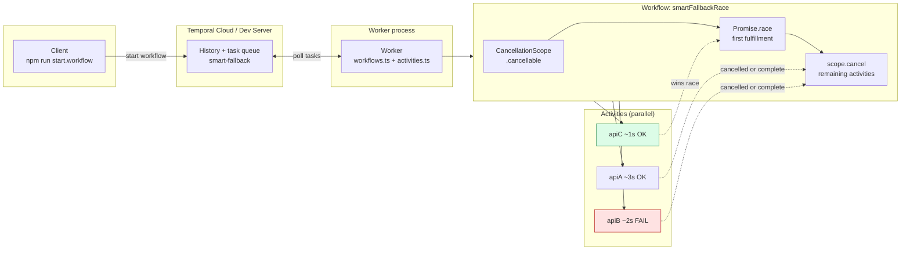
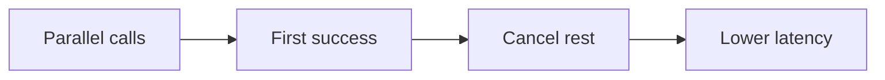

# Slide material — Smart Fallback Orchestrator

Use **`slide-architecture.svg`** in Google Slides / Keynote / PowerPoint (Insert → Image), or paste the Mermaid below into [Mermaid Live](https://mermaid.live) and export PNG/SVG.

---

## Architecture diagram (Mermaid)

Paste into Mermaid Live or a Mermaid-capable slide tool.

**Simplified one-liner for a title slide:**

---

## Test cases

| ID | Scenario | Setup | Expected result |
|----|-----------|--------|-----------------|
| TC-1 | Default demo race | A=3s OK, B=2s fail, C=1s OK (current mocks) | Workflow completes with `winner: "C"`, `value: "response-C"`. Worker logs show C success before A completes; B fails. Remaining work cancelled per scope. |
| TC-2 | Fastest is A | Make C slower than A (e.g. C=5s, A=1s) and B still fails | `winner: "A"`, `value: "response-A"`. |
| TC-3 | B wins when only B succeeds | A and C throw or exceed timeout; B succeeds | `winner: "B"` with B’s payload (if you change B to succeed for this test). |
| TC-4 | All paths fail | All activities throw | Race never fulfills with current `raceCandidate` pattern — workflow should hang until timeout or adjust mocks to fail fast with `Promise.any` + timeout (optional hardening). |
| TC-5 | Idempotent replay | Run same workflow twice | Two successful executions; histories independent; no duplicate side effects beyond mocked logs. |
| TC-6 | Worker restart mid-flight | Start workflow, kill worker, restart worker | Temporal redelivers tasks; workflow completes (activities may retry per policy). |

**Manual checklist (hackathon demo):**

1. `temporal server start-dev` running.
2. `npm run start.worker` — no connection errors.
3. `npm run start.workflow` — prints result JSON with C as winner.
4. Worker console shows order: all three started → C success → cancel narrative in workflow logs.

---

## Success scenarios (what “good” looks like)

1. **Functional success** — Client receives a completed workflow result with the **first successful** activity among parallel calls, matching the intended mock timings.
2. **Orchestration success** — Workflow logs show parallel start, selection of the winner, and **cancellation** of the cancellable scope (remaining activities receive cancellation / do not block the result).
3. **Observability success** — Judges can read worker output and see **A still slow, B failing, C winning** without a custom UI.
4. **Story success** — You can explain: *speculative parallel execution* reduces tail latency compared to serial try/fallback.
5. **Reliability narrative** — Same pattern extends to real HTTP providers with timeouts, cost tiers, or region failover (even if the hackathon uses `setTimeout` only).

---

## File reference

- Static diagram: [`slide-architecture.svg`](slide-architecture.svg)
- Code: `src/workflows.ts`, `src/activities.ts`, `src/worker.ts`, `src/client.ts`
